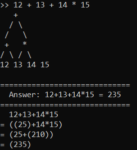
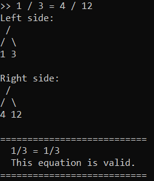

# algebra-calculator
A calculator for symbolically simplifying basic math expressions and validating equations

Originally created for Data Structures class at Carleton College in December 2021. Binary tree display created by Prof. Anya Vostinar.

## Examples




## Getting started
To run, type on command line:

```$ java Calculator```

Then input input a math expression or equation.

Additionally, you can:
* type "help" for usage statement
* type "history" for a log of what you've done already
* type "exit"

If you input a math expression, the program will simplify it and display the answer.
If you input a math equation, the program will tell you whether it is true.

## Features
This program understands:
* Integers
* Standard arithmetic operators: + - * /
* Parenthesis
* Equations - insert an equal sign between two expressions

The program will simplify fractions to their lowest terms
